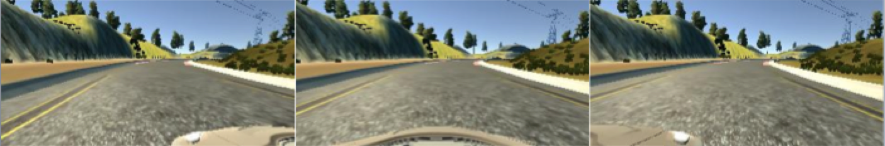
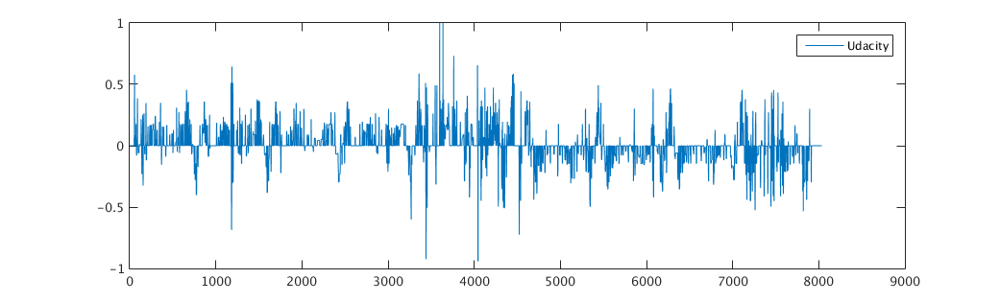
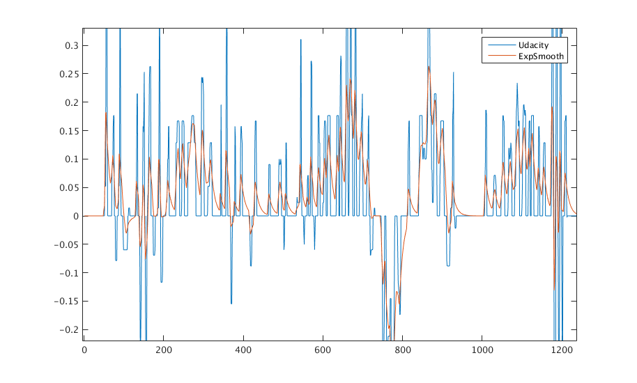

# Udacity-P3-BehavioralCloning
Submission for Udacity's Project 3 - Training Car to Drive Autonomously in Simulator

# Approach
My general approach for this project was to use the provided training data from Udacity and as many data augmentation techniques as necessary to produce a working model. While this project could have been handled with regression or classification (binning the steering angles into classes) I found regression to be much more successful and easier to implement. I tried two different models: the first being the well-established NVIDIA model from their paper and the second being a model that I had developed for Udacity’s Open Source Challenge #2 ‘Using Deep Learning to Predict Steering Angles’ (https://github.com/chrisgundling/self-driving-car/tree/master/steering-models/community-models/cg23). The models were vastly different as NVIDIA’s only uses 250,000 parameters whereas the VGG style model has over 33 million parameters. 

I experimented with different data-preprocessing techniques, 7 different augmentation methods and varied the dropout of each of the two models that I tested. In the end I found NVIDIA’s architecture to work significantly better and require less tuning. My final NVIDIA model did not use dropout and was able to drive on both Track 1 and 2 with either 0.2 or 0.3 throttle values. The larger VGG type model could have been further improved, but it took significantly longer to train and required more hyper-parameter tuning. I have included both models for the reviewer to test, but the best results were using the NVIDIA model with 0.2 on Track 1 and 0.3 throttle on Track 2 to get up the steepest hills.

# Hardware/Testing Setup
I trained these models using a modified version of Udacity’s CarND AWS AMI with a g2.2xlarge GPU and tested the models on my Macbook Pro laptop. The simulator was set to the 'Fastest' setting with screen resolution of 640 X 480. I adjusted the drive.py script to implement the same pre-processing methods that I used for the training data (cropping, re-sizing, normalizing images).

# Data Exploration
The data provided by Udacity consisted of 8036 center, left and right .jpg images for a total data size of 24809 examples. These images were of 160 Height by 320 Width. An example of the center image taken from the car is shown below.

| Left Camera | Center Camera | Right Camera |
| :-------------------------------------: | :-------------------------------------------:| :----------------------------------------:|

The steering angles provided in the driving log have been plotted below. 

The steering angles in the driving_log.csv file came pre-scaled by a factor of 1/25 so that they are between -1 and 1 (The max/min steering angle produced by the simulator is +/- 25 degrees). I knew that I would need an evaluation metric for the model training, so I split out 480 center camera images and their corresponding steering angles to use for the validation set. This is a smaller validation set (validation set size approximately 5% of the training set size) than I would typically use, but I didn’t want to give up too much of the training data. I could have implemented k-fold cross validation to develop a better validation error metric, but I found that the single validation set corresponded fairly well with actual driving capability. I did not use a dedicated “test set” to calculate the RMSE, but I instead considered the performance on Track 2 to be my test set. I held off on testing on Track 2 until I found a model that I though performed very well on Track 1.

# Data Pre-Processing
I followed the discussions closely on Slack regarding collecting training data. It seemed that a lot of people were having difficulties collecting “smooth” steering data using just their keyboards. The Udacity data helped this problem some, but based on the experience that I had will using real human steering data from Udacity’s Challenge #2, the provided simulator steering data still appeared much more step like. 

## Exponential Smoothing
I addressed this issue by applying an exponential smoothing to the steering training data in the driving_log.csv file. Exponential smoothing (Brown’s Method) helped to produce smoother steering transitions, but also truncated and shifted the data. I applied a scaling to recover some of the amplitude of the steering and shifted the data by several time steps so that the steering would not be delayed. The result of the exponential smoothing can be seen below for the first ~1200 training examples.

## Normalization
Similar to Project 2, I normalized all of the image pixel values using the equation (x-128)/128. This normalizes the values to be between -1 and 1. I did this for the training data, validation data and implemented it in the drive.py script for testing the model.
## Cropping
I cropped off the bottom 20 pixels and the top 40 pixels from each image after augmentation. This removed the front of the car and most of the sky above the horizon from the images. I did this for the training data, validation data and implemented it in the drive.py script for testing the model.
## Re-sizing
For the NVIDIA model, I stayed consistent with their approach and used images with a height of 66 and width of 200 pixels. For the VGG style model I used 128 x 128 images as I had found this to be successful during Udacity’s Challenge #2. I did this for the training data, validation data and implemented it in the drive.py script for testing the model.
## Data Augmentation
I used 7 different augmentation techniques to increase the number of images that the model would see during training. This significantly reduced my models tendency to over-fit the data to the point where I saw no performance benefit of using dropout with the NVIDIA model. The augmentations were performed on the fly using a custom generator/yield method. The data augmentation techniques that I implemented were the following:

1.	Perspective/Viewpoint Transformations – Similar to what is described in the NVIDIA paper, I applied rotational perspective transforms to the images. The function to perform this operation was provided by Udacity’s Yousuf Fauzan after I met him at the “Outside the Lines” event as he had already implemented this technique for Challenge #2. The script uses a rotation matrix to do a perspective transform of varying degree to the image. I had to do some tuning to the steering angle adjustment for the perspective transforms as I found that a one to one perspective transform angle to steering angle adjustment was much too large. I settled on rotating the images uniformly between -80 to 80 degrees. I then divided the perspective angle by 200 in order to adjust the steering angle. This gave max/min steering angle adjustments of +/- 0.4 units or 10 degrees.

2.	Image flipping – Since the left and right turns in the training data are not even, image flipping was important for model generalization to Track 2. I also flipped the sign of the steering angle when an image was flipped.

3.	Left/right camera images – I used the left/right camera images from the car which immediately triples the training data size. After closely examining the left/right images and looking for common features to the center images, I estimated that the left right images where offset horizontally from the center camera by approximately 60 pixels. Based on this information, I used a steering angle correction of +/- 0.25 units or +/- 6.25 degrees for these left/right images. 
 - I also tried to implement a speed based steering angle correction since my intuition was that at higher speeds the steering correction should be smaller or more gradual. I was surprised to find that I could not get this to work as well as having a constant steering angle correction. I think that with further adjustment and better knowledge of the left/right camera image location that this method would work.
 - Speed based steering adjustment was implemented by defining a response time of 2 seconds for the car to return to center. The following diagram then shows how the steering angle correction was calculated:

As the speed of the car increases, the steering angle needed to return to center in 2 seconds decreases. 

4.	Horizontal/Vertical shifting – I applied horizontal and vertical shifting to the images. My max/min horizontal and vertical shifts were 40 pixels in each direction. I tuned this value during model training. Considering that I estimated the left/right images to be offset by 60 pixels, I applied a slightly smaller steering angle correction for the horizontal shifts. The vertical shifts had no steering angle correction. I also attempted speed based correction for the horizontal shifts. 

5.	Image Brightness – I adjusted the brightness of the images by converting to HSV color space and scaling the V pixels values from 0.6 to 1.2. This was mostly to help generalize to Track 2 where the images were darker in general.

6.	Image Blurring – I’m not sure how useful this technique was for the simulator, but this technique should help the model generalize when using more “real world” type data that does suffer from blurring at times. I used a variable Gaussian smoothing to blur the images.

7.	Image Rotations – Different from perspective transforms, I implemented small rotations to the images to simulate jittering of the camera. Once again, not sure how useful this was for the simulator, but would be useful for a real camera on a self-driving car.

# Data Generator
The data generator that I used selected randomly between the center/left/right images and also selected at random which augmentation techniques to apply. I found that only providing augmented training data did not work as well as training the model with a combination of the original center images and the augmented images. I also implemented a bias towards first training the model with larger turns and then allowing the data with smaller turns to slowly leak into the training. This idea is directly credited to a few of the other students who posted this idea on Slack. If the model is initially trained with low steering angles it will be biased towards straighter driving and I found that it did not perform well in the corners. The generator also shuffled the training data, whereas the validation data was read in in sequence.

# Model Setup and Hyper Parameters
My goal was to train each of my two models 1. NVIDIA type and 2. VGG type with as many similar hyper-parameters as possible. I used the following parameters for training of both models.
Max number of Epochs – 10 (5 or 6 Epochs of training typically gave best model)
Samples Per Epoch – 
Batch Size

# Model Architecture
The model architectures for each of the two models can be seen below. As mentioned in the introduction, my main tuning parameter with these models the dropout. For the NVIDIA model it was somewhat surprising to find that the model performed best on both Track 1 and 2 with no dropout. The model size is relatively small and with all of the applied image augmentations any dropout caused the car not to steer hard enough in the corners. For the VGG type model it was a different story, the model is much larger and relies on dropout. Even with dropout applied I could not get this model to drive very smoothly (most likely still over-fitting the data).

## Structure and Parameters
| Layer | Size | Memory (Forward Pass) | # Parameters (Not Counting Bias) |
| ---- | :------------------:| --------:| ---------------:|
| input | 128 X 128 X 3 | 0.05 MB | 0 |
| conv1 | 128 X 128 X 32 | 0.52 MB | 864 | 
| pool1 | 64 X 64 X 32 | 0.13 MB | 0 | 
| conv2 | 64 X 64 X 64 | 0.26 MB | 18432 | 
| pool2 | 32 X 32 X 64 | 0.07 MB | 0 | 
| conv3 | 32 X 32 X 128 | 0.80 MB | 73728 | 
| pool3 | 16 X 16 X 128 | 0.20 MB | 0 | 
| FC1 | 1 X 1 X 1024 | 0.001 MB | 33554432 | 

Based on the notes from Stanford's CS231n, this gives 8 MB (~2MB * 4 bytes) for each image on forward pass and 16 MB on the backward pass.  Using a batch size of 32, the max memory usage will be 512 MB during the backward pass.

Over 99% of the parameters in this model are in the FC1 layer. Comparing the structure and parameters to NVIDIA’s model, at nearly 34 million parameters, this model has significantly more parameters than NVIDIA’s. Even with the dropout and various image augmentation techniques this model still overfits.

# Results
The following videos show side by side comparisons of the two models for both Track 1 and 2. Clearly the NVIDIA model is able to steer more smoothly and confidently on both tracks. 
